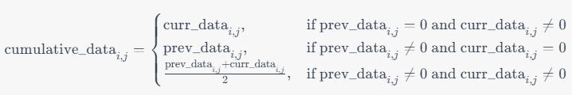

# 이미지 분석을 통한 로봇 위치 보정 알고리즘 및 Arm 피드백 제어 기술

## 1. 프로젝트 개요

### 1-1. 과제 개요
- 본 과제는 Boston Dynamics의 로봇 `SPOT`을 사용한 실시간 조립 품질 검사를 수행할 때, `로봇의 Arm 정밀 제어 기술` 개발에 집중합니다.
- 실시간 조립 품질 검사를 수행할 때, 
- 기존의 방식인 2D 이미지의 SURF 알고리즘을 통한 정합에는 조명 등의 외부 요인에 취약하다는 단점이 있습니다.
- 이를 위해 우리는 이미지 분석을 활용한 위치 보정 알고리즘을 개발하고, 로봇 Arm의 피드백 제어 매커니즘을 개선하였습니다.
- 이러한 개선을 통해 로봇 Arm의 동작 정확도를 향상시키고, 이를 통한 실시간 조립 품질 검사의 정확성을 높이는 것이 본 과제의 주요 목표입니다.

### 1-2. 과제 목표
- 이미지 분석 알고리즘을 개발하여 로봇의 Arm 위치 보정의 정확도 향상
- 이미지의 반복 취득 및 분석을 가능하게 하는 프로그램 개발
- 보정 알고리즘과 Arm의 피드백 제어 매커니즘을 통합하여 SPOT의 실시간 조립 품질 검사의 능력 향상

### 1-3. 과제 수행 결과
- SPOT API를 활용하여 실시간으로 2D RGB 이미지 및 3D Depth를 취득하고, 이를 분석하여 SPOT Arm의 위치를 보정하는 기술을 개발하였습니다.
- SPOT을 제어할 수 있고, 이미지의 반복 취득 및 분석을 위한 프로그램을 개발하였습니다.

---

## 2. 기술 개발 내용

### 2-1. 이미지 취득 및 분석 (2D, RGB)
- SPOT의 실시간 조립 품질 검사를 수행할 때, 기존의 방식은 **SURF(Speed-Up Robust Feature)** 알고리즘을 사용하여 두 개의 2D 이미지를 정합하고, 이를 통해 Homography Matrix를 획득하였습니다.
- 기존의 방식의 가장 큰 문제점은 **조명 등 외부 요인에 의한 RGB 이미지의 변화**에 매우 취약합니다.
- SURF를 통해 두 개의 2D 이미지 정합 시, 변환 행렬을 얻을 수 있습니다. 하지만, 이 행렬은 2D 이미지 사이의 변환에 대한 정보만을 제공하며, 3D 공간에 대한 정보를 제공하지 못함을 확인하였습니다.

### 2-2. 이미지 취득 및 분석 (3D, Depth)
- SPOT Arm에 부착되어 있는 ToF(Time-of-Flight) 카메라를 사용하여 Depth 데이터를 획득하였습니다.
- 획득한 Depth 데이터는 이상치가 많이 포함된 데이터입니다. 따라서, Depth 데이터의 신뢰도를 높이기 위해 다양한 방법을 적용하여 데이터의 신뢰도를 높였습니다.

#### ① Depth 데이터 누적
- ToF 카메라는 높은 정확성을 가지지만, 동일한 위치에서 여러 번 촬영한 결과, 같은 위치의 픽셀에서 데이터의 유무에 차이가 발생합니다.
  - 이러한 차이는 광원의 불안정성, 조도의 미세한 차이, 먼지 등 여러 요인에 의해 발생할 수 있습니다.
  - 데이터의 손실이 발생한 부분을 보정하기 위해 **Depth 데이터를 여러 번 반복하여 획득**한 후, 해당 위치에서의 데이터를 결합하여 **누적**합니다.
- 현재 데이터 `curr`과 이전 데이터 `prev`에 대한 누적 데이터 `cumulative`를 구하는 수식은 다음과 같습니다.

<!--  -->
\[
\text{{cumulative}}[i, j] = \begin{cases}
\text{{curr}}[i, j] & \text{{if }} \text{{prev}}[i, j] = 0 \land \text{{curr}}[i, j] \neq 0 \\
\text{{prev}}[i, j] & \text{{if }} \text{{prev}}[i, j] \neq 0 \land \text{{curr}}[i, j] = 0 \\
\frac{{\text{{prev}}[i, j] + \text{{curr}}[i, j]}}{2} & \text{{if }} \text{{prev}}[i, j] \neq 0 \land \text{{curr}}[i, j] \neq 0 \\
\end{cases}
\]

#### ② 포인트 클라우드 획득
- 누적하여 획득한 Depth 데이터를 3D Point Cloud로 변환합니다.
- 변환에 필요한 데이터는 다음과 같습니다.
  - `Depth Map`
    - Depth Map은 2차원 이미지이며, 각 픽셀의 값은 카메라로부터 해당 픽셀까지의 거리를 나타냅니다.
  - `Camera Intrinsics`
    - 카메라의 내부 파라미터로, 초점 거리(focal length), 광학 중심(optical center) 등을 포함합니다.
    - 카메라 내부 파라미터는 Depth Map에서 각 픽셀의 3D 좌표를 계산하는 데 사용됩니다.
  - `Camera Extrinsics (If necessary)`
    - 카메라의 외부 파라미터로, 카메라가 공간에서 어떤 위치와 방향을 가지고 있는 지를 나타냅니다.
    - 카메라 외부 파라미터는 3D 장면에서 카메라의 위치를 찾는 데 사용됩니다.
- 우리는 누적된 Depth Map을 가지고 있고, SPOT API에서 획득 가능한 정보는 **초점 거리(focal length)와 광학 중심(optical center)** 정보입니다.
  - 광학 중심은 `principal point`라는 이름으로 제공됩니다.
- 변환된 포인트 클라우드의 이상치를 제거할 수 있습니다.

#### ③ 이상치(Outlier) 제거
- Depth 데이터를 분석할 때 이상치를 제거하는 이유는 데이터의 정확성을 높이고, 결과적으로 더 정확한 3D 모델을 생성하기 위함입니다.
- 이상치는 카메라의 노이즈, 빛의 반사, 투과, 그림자, 물체의 잘못된 인식 등으로 인해 잘못된 깊이 정보가 생성될 수 있습니다.
- 이상치는 분석 결과를 왜곡시키고, 이를 기반으로 한 결정이나 조치가 부정확해질 수 있습니다.
- 즉, 로봇 Arm의 위치 보정 시 잘못된 위치를 지정할 수 있으며, 로봇의 동작이 부정확해지거나 예상치 못한 결과를 초래할 수 있습니다.
- 따라서, 이상치를 식별하고 제거하는 것은 Depth 데이터를 다루는 데 중요한 부분이며 이를 통해 3D 모델의 정확성을 높이고, 로봇 Arm의 정확한 위치 보정을 가능하게 합니다.
- 본 프로젝트에서는 세 가지 방법을 적용하여 이상치를 제거하였습니다.

***1. IQR (Interquartile Range, 사분위 범위)***
- IQR이란?
  - IQR, 즉 사분위수 범위는 데이터의 중간 50% 범위를 나타냅니다. 이는 데이터의 분포와 이상치를 평가하는 데 사용되며, 특히 이상치가 있는 데이터에 대한 강력한 추정치를 제공합니다.
  - IQR은 데이터 세트의 상위 25% (제3사분위수, *Q3*)와 하위 25% (제1사분위수, *Q1*)의 차이로 계산됩니다.
  - 계산된 IQR을 사용하여 이상치가 있는 범위를 정의합니다. 이 범위는 *Q1*에서 *1.5IQR*을 뺀 값부터 *Q3*에 *1.5IQR*을 더한 값까지 입니다. 이 범위를 벗어나는 값은이상치로 간주됩니다.

  - `IQR = Q3 − Q1`
  - `[Q1 − 1.5 × IQR, Q3 + 1.5 × IQR]`

  - Q1, Q3 인수
    - 통상적으로 제1사분위수와 제3사분위수는 상위 25%, 하위 25%를 나타냅니다.
    - 우리는 백분위수 범위를 설정할 수 있도록 하였습니다.
      - 예를 들어, q1=30, q3=70으로 설정하면, 하위 30% 백분위수와 상위 30% 백분위수를 제외한 중간 40%의 범위를 대상으로 합니다.
      - q1=20, q3=80으로 설정하면, 하위 20% 백분위 수와 상위 20% 백분위수를 제외한 중간 60%의 범위를 대상으로 합니다.
      - 따라서, q1과 q3의 값에 따라 IQR을 계산하는 범위와 중심이 변경되며, 이는 이상치를 어느 정도의 엄격성으로 처리할지를 결정하는 중요한 요소입니다.

- **본 데이터의 특성은 데이터의 대부분이 0**이라는 것입니다. 따라서, 이상치 제거를 할 때 주의해야 할 점은 다음과 같습니다.
  - *0 값에 대한 고려:* 데이터의 대부분이 0이므로, 이 0값들이 실제 관측치인지, 아니면 결측치나 다른 형태의 '비정상적인' 값으로 처리해야 하는지 고려합니다.
  - *이상치 정의:* 데이터의 중간값이 0인 경우라면, 일반적인 IQR 방법을 사용해 이상치를 정의하는 것은 바람직하지 않을 수 있습니다.
- 0 값은 결측치로 정의하였고, 이상치를 판단할 때는 0을 제외한 값들만 대상으로 삼았습니다.
- 이 방법을 통해 데이터 분포의 왜곡을 없앨 수 있습니다.
- 파라미터
  - `q1 = 20`, `q3 = 80`으로 설정하여 데이터를 취득하였습니다.

***2. Gaussian (정규분포)***
- 가우시안 분포에 기반한 이상치 검출 방법은 데이터가 정규 분포를 따른다는 가정하에 이용됩니다.
- IQR을 사용하여 데이터 분포의 왜곡을 없앤 결과, 데이터가 정규 분포에 가깝도록 하는 효과가 있습니다.
- 이 방법에서는 데이터의 평균과 표준편차를 사용하여 이상치를 정의합니다.
- **표준 점수(z)** 는 각 데이터 포인트가 평균으로부터 얼마나 떨어져 있는지를 측정합니다.
- `z = (X - μ) / σ`
  - X는 각 데이터 포인트, 
  - μ는 데이터 세트의 평균, 
  - σ는 데이터 세트의 표준 편차입니다.
- 표준 점수가 threshold 값을 초과하는 데이터 포인트를 이상치로 간주합니다.
- 파라미터
  - threshold 값을 `3`으로 설정하여 데이터를 취득하였습니다.

***3. SOR (Statistical Outliers Removal) Filter***
- SOR Filter는 통계적인 방법을 사용하여 이상치를 감지하고 제거합니다.
- 각 데이터 포인트의 _K-nearest neighbors(KNN)_ 의 평균 거리를 계산하여 작동합니다.
- 이 거리가 평균 거리에서 표준편차의 일정 배수 이상 떨어진 데이터 포인트를 이상치로 판단합니다.
- 이는 주어진 데이터 포인트가 다른 포인트들로부터 너무 멀리 떨어져 있어 노이즈일 확률이 높다는 가정에 기반합니다.
- SOR Filter의 결과, 3D 모델의 표면을 매끄럽게 하는 효과가 있습니다.
- 파라미터
  - nb_neighbors(각 포인트의 이웃 개수): `20`
  - std_ratio(표준 편차의 배수): `2.0`

### 2-3. 3D Point Cloud 정합

#### 2-3-1. ICP 알고리즘

ICP(Iterative Closest Point) 알고리즘은 두 개의 Point Cloud 데이터셋 사이에서 가장 잘 맞는 변환 행렬을 찾는 알고리즘입니다.

ICP 알고리즘의 작동 과정은 다음과 같습니다:

***1. 초기화***
- 두 개의 입력 포인트 클라우드를 준비합니다. 하나는 원본 포인트 클라우드(Source Point Cloud)이고 다른 하나는 대상 포인트 클라우드(Target Point Cloud)입니다.

***2. Correspondence(대응) 찾기***
- Target 포인트 클라우드의 각 포인트에 대해 Source 포인트 클라우드에서 가장 가까운 포인트를 찾아 대응시킵니다. 이를 위해 최소 거리 또는 최소 에러 기준으로 가장 가까운 포인트를 찾습니다.

***3. 변환 행렬 추정***
- 대응된 포인트 쌍을 기반으로 Source 포인트 클라우드를 Target 포인트 클라우드에 가장 잘 맞도록 변환하는 변환 행렬을 추정합니다. 

***4. 수렴 검사***
- 변환 행렬을 적용하여 Source 포인트 클라우드를 Target 포인트 클라우드에 맞추고, Target 포인트 클라우드와 Source 포인트 클라우드 간의 오차를 계산합니다. 이 오차가 수렴 기준(threshold)보다 작으면 알고리즘이 수렴한 것으로 판단합니다. 그렇지 않으면 2단계부터 4단계까지 반복하여 수렴할 때까지 알고리즘을 실행합니다.

***5. 최적 결과 반환***
- 알고리즘이 수렴한 후, 최적의 변환 행렬과 대응된 포인트 쌍을 반환합니다. 이를 통해 두 포인트 클라우드를 최적으로 정렬하거나 등록할 수 있습니다.

ICP 알고리즘은 반복적인 과정을 통해 점진적으로 두 개의 포인트 클라우드를 맞추는 방식으로 작동합니다. 이를 통해 변환 행렬을 추정하고, 오차를 최소화하여 두 포인트 클라우드를 정렬하는 것이 목표입니다.

*그림. ICP 알고리즘을 사용하여 두 포인트 클라우드가 정합되는 과정*

#### 2-3-2. 두 포인트 클라우드 정합
- 두 위치에서 촬영하여 획득한 포인트 클라우드를 ICP 알고리즘을 사용하여 정합 합니다.
- ICP 알고리즘의 결과, Source 포인트 클라우드를 Target 포인트 클라우드로 변환하는 행렬(Transformation Matrix)을 획득할 수 있습니다.
- [이미지: 두 개의 포인트 클라우드를 ICP로 정합한 결과]

### 2-4. SPOT Arm 위치 보정을 위한 SPOT API와 ICP 결과 변환 행렬의 활용
#### 2-4-1. Frame, SE3Pose
- SPOT API를 사용하여 Arm을 제어할 때, `Frame`과 `SE3Pose`라는 두 가지 핵심 개념을 이해해야 합니다.
- `Frame`
  - SPOT은 세상을 이해하고, 자신과 주변 객체들의 위치를 표현하기 위해 3D 변환(Transformation)을 사용합니다.
  - SPOT은 이러한 변환을 나타내기 위해 다양한 **Frame**을 사용하며, 이들 Frame은 로봇 자체, 센서, 그리고 주변 객체를 나타냅니다.
  - Frame에는 관성 프레임(Inertial Frames), 센서 프레임(Sensor Frames), 객체 프레임(Object Frames), 그리고 로봇의 몸체 프레임(Body Frame)이 있습니다.
  - `Inertial frames`
    - 관성 프레임은 `vision frame`, `odometry(odom) frame`이 있습니다.
    - 이 프레임들은 로봇이 부팅될 때 body와 동일한 원점과 초기 회전 값을 가진 프레임입니다.
    - 즉, 이 프레임들은 부팅될 때 로봇 본체의 원점에서 시작합니다.
    - 그리고, 로봇이 어떤 방향을 보고 있을 때, 해당 프레임들도 같은 방향을 보고 있게 됩니다.
  - `Sensor frames`
    - 센서 프레임은 주어진 센서의 원점과 좌표 축을 설명합니다.
    - 예를 들면, 카메라 이미지나 포인트 클라우드 등은 센서의 문자열 프레임 이름을 포함하게 될 것입니다.
    - 센서 프레임은 주로 센서를 사용하여 감지된 객체를 설명하는 데 사용됩니다.
  - `Body frame`
    - 로봇의 위치와 방향을 설명하며, 로봇의 각 관절마다 다른 프레임이 존재합니다.
    - 로봇의 자세를 완전히 표현하기 위해서는 로봇의 각 관절에 대한 프레임 값을 더하면 됩니다. (two hip joints and one knee per leg.)
  - `Hand frame`
    - 핸드 프레임은 원점이 Gripper의 손바닥 플레이트(palm plate)의 약간 앞쪽에 위치하고 있으며, 손목(wrist)의 방향에 맞게 정렬됩니다.
    - 핸드 프레임의 원점의 위치는 parent wrist frame에 대해 다음과 같습니다.
      - `x = 0.19557m`, `y = 0m`, `z = 0m` 
    - 핸드 프레임과 손목 사이의 회전은 항등 행렬(Identity Matrix)입니다.
  - 로봇이 돌아다닐 때, 두 프레임 간의 관계는 항상 동일하게 유지될 수도 있고, 동적으로 변할 수도 있습니다.
  - 관성 프레임과 로봇의 바디 프레임 사이의 변환은 로봇이 움직임에 따라 변하게 됩니다.
  - **반면, 바디 프레임과 카메라 프레임 사이의 변환은 로봇이 움직이든 움직이지 않든 변하지 않을 것입니다.**
- `SE3Pose`
  - 로봇공학에서 3차원 공간에서의 객체의 위치와 방향을 나타내는 방법입니다.
  - SE3Pose는 **S**pecial **E**uclidean Group **3**, 줄여서 SE(3)를 의미하며, 이는 평행이동(Translation)과 회전(Rotation)을 통합하여 표현한 3차원 공간에서의 변환입니다.
  - SE3Pose는 이 변환을 나타내기 위해 사용되는 데이터 구조입니다.
  - SE3Pose는 두 가지 구성요소를 가집니다.
    - Translation Vector : 3차원 공간에서의 위치를 나타내는 벡터입니다. (x, y, z) 형태의 좌표로 표현됩니다.
    - Rotation Quaternion : 3차원 공간에서의 회전을 나타내는 사원수(Quaternion)입니다. 사원수는 스칼라 부분(w)과 벡터 부분(x, y, z)을 가지며, 이를 사용하여 회전 축과 각도를 표현합니다.
  - SPOT API의 SE3Pose는 두 프레임 사이의 관계를 설명하는 데 사용됩니다.
  - 여기서 `이동(Translation)`은 `로봇 몸체 중심의 위치`를 나타내고, `사원수(Quaternion)`는 `세계 프레임에 대한 로봇 몸체의 방향`을 나타냅니다.
  <pre style="background-color: lightgray;">
  SE3Pose
     ├── Translation Vector  (Position) : [x, y, z]
     └── Rotation Quaternion (Rotation) : [w, x, y, z]
  </pre>

  - 실제 데이터 예시
  <pre style="background-color: lightgray;">
  body_tfrom_hand
     ├── position
     │     ├── x: 0.8
     │     ├── y: 0.2
     │     └── z: 0.3
     └── rotation
            ├── w: 1
            ├── x: 0
            ├── y: 0
            └── z: 0
  </pre>

#### 2-4-2. ICP 결과 변환 행렬
- ICP 알고리즘의 결과 변환 행렬은 두 포인트 클라우드 사이의 이동 및 회전을 나타내는 4x4 행렬입니다.
- 일반적인 변환 행렬과의 차이점은 스케일링이 포함되지 않은 불변형(Affine) 변환을 나타낸다는 것입니다.
- ICP 알고리즘의 결과 변환 행렬은 다음과 같은 형태를 가집니다.

<pre>
T = | R t |
    | 0 1 |
</pre>

- R은 3x3 회전 행렬이고, t는 3x1 이동 벡터입니다. 0은 1x3 영행렬(zero matrix)이며, 1은 스칼라 입니다.
- 변환 행렬 T는 SE3Pose와 유사하게 3D 공간에서의 이동과 회전을 나타냅니다.

#### 2-4-3. 보정 프로세스
- 이번 장에서는 ICP 알고리즘의 결과 변환 행렬을 로봇 Arm 위치 보정에 어떻게 적용할 수 있는지 설명합니다.
- 로봇 Arm 보정 과정은 다음과 같습니다.
> ***1. 원본(Source) 데이터 수집 및 등록***  
  ***2. 대상(Target) 데이터 수집 및 비교***  
> ***3. ICP를 이용한 데이터 정합***  
> ***4. SPOT 좌표계에 적용을 위한 변환 행렬의 재배열***  
> ***5. 변환 행렬의 적용 및 위치 보정***  
> ***6. 결과 분석과 보정 효과의 평가***  

---

##### ① 원본(Source) 데이터 수집 및 등록
- 먼저, 특정 위치에서 로봇이 촬영한 데이터를 "Source"로 등록합니다.
- 원본(Source)에 등록되는 데이터는 `2D RGB 이미지`, `3D Depth(Point Cloud)` 입니다.

<figure style="display: inline-block;">
  
  <figcaption>Source 에 등록된 2D RGB 이미지</figcaption>
</figure>
<figure style="display: inline-block;">
  
  <figcaption>Source 에 등록된 3D Depth(Point Cloud)</figcaption>
</figure>

##### ② 대상(Target) 데이터 수집 및 비교
- 같은 위치에서 새로 데이터를 수집합니다. 명령에 따라 로봇이 같은 위치와 자세로 데이터를 수집하도록 하지만, 실제 환경에서는 오차가 발생합니다.
- 대상(Target)에 등록되는 데이터는 `2D RGB 이미지`, `3D Depth(Point Cloud)`, `로봇 Arm의 SE3Pose(body_tform_hand)` 입니다.

##### ③ ICP 알고리즘을 이용한 두 포인트 클라우드 정합
- Source에 등록된 Point Cloud와 Target에서 획득한 Point Cloud를 ICP 알고리즘을 사용하여 정합합니다.
- ICP 알고리즘의 결과, Source Point Cloud를 Target Point Cloud로 정합하는 변환 행렬을 얻을 수 있습니다.

##### ④ SPOT 좌표계에 적용을 위한 변환 행렬의 재배열
- ICP 결과 변환 행렬을 이용해 SPOT Arm을 보정하기 위해서는 다음과 같은 작업이 필요합니다.

1. **변환 행렬 재배열**
   - ICP의 변환 행렬은 Source Point Cloud를 Target Point Cloud로 변환하는 행렬입니다.
   - 우리의 목적은 Target Point Cloud를 Source Point Cloud로 변환하는 것이기에 역행렬을 취합니다.
   - `T_inverse = T.I (여기서 T.I는 변환 행렬 T의 역행렬을 의미합니다)`
2. **SPOT 좌표계에 맞게 재배열**
   - SPOT Arm의 좌표계는 일반적으로 사용하는 유클리드 공간에서의 좌표계와 다릅니다. 기존 좌표계에서 (x, y, z)는 일반적으로 (가로, 세로, 깊이)를 나타내지만, SPOT Arm의 좌표계에서는 (y, z, x)가 각각 (가로, 세로, 깊이)를 나타냅니다. 즉, x, y, z 축이 다음과 같이 매핑됩니다:
     - SPOT Arm의 `x축`은 우리가 일반적으로 생각하는 `깊이`를 나타냅니다. 즉, 앞뒤로의 움직임을 표현합니다. 
     - SPOT Arm의 `y축`은 우리가 일반적으로 생각하는 `가로`를 나타냅니다. 즉, 좌우로의 움직임을 표현합니다. 
     - SPOT Arm의 `z축`은 우리가 일반적으로 생각하는 `세로`를 나타냅니다. 즉, 위아래로의 움직임을 표현합니다. 
   - 따라서, ICP에서 얻은 변환 행렬을 SPOT Arm의 좌표계에 맞게 재배열해주어야 합니다. 이는 변환 행렬의 Translation 부분(이동 벡터)과 Rotation 부분(회전 행렬) 모두에 적용되어야 합니다.
3. **SPOT Arm SE3Pose를 행렬으로 표현**
   - 이 단계에서 중요한 것은 SPOT Arm의 위치와 방향 정보인 SE3Pose를 4x4 동차 좌표계 행렬로 변환하는 것입니다. 이 변환은 ICP 결과 변환 행렬과 SPOT Arm의 위치 정보를 일관된 형식으로 맞추어 연산을 가능하게 합니다.
   - 동차 좌표계는 공간상의 위치와 방향을 동시에 표현할 수 있는 행렬 형식이며, 이는 ICP 변환 행렬과의 행렬 곱 연산을 가능하게 합니다.
   - SE3Pose를 동차 좌표계로 변환하는 것은 다음과 같은 과정을 포함합니다:
     - 먼저 SE3Pose에서 위치 정보를 가져와서 4x4 행렬의 오른쪽 상단 열로 채웁니다. 
     - 다음으로 SE3Pose의 방향 정보(쿼터니언)을 3x3 회전 행렬로 변환하고, 이를 4x4 행렬의 왼쪽 상단에 위치시킵니다. 
     - 마지막으로, 4x4 행렬의 나머지 부분을 채웁니다. 이 때, 4번째 행은 [0, 0, 0, 1]로 설정합니다. 이렇게 함으로써 행렬의 마지막 행이 [0, 0, 0, 1]인 동차 좌표계 행렬이 완성됩니다. 
   - 이 과정을 통해 SPOT Arm의 SE3Pose는 4x4 동차 좌표계 행렬로 변환되어, 보정 좌표를 획득하기 위한 준비가 완료됩니다.
4. **보정 좌표 계산**
   - 이 단계에서는 이전 단계에서 준비한 변환 행렬(`T_inverse`)과 SPOT Arm의 동차 좌표계(`H`)를 활용하여 보정 좌표를 계산합니다. 이를 위해서는 `T_inverse`와 `H`를 행렬곱합니다.
   - `H_corrected = T_inverse * H`
   - 이 결과는 4x4 동차 좌표계 행렬이며, 이를 다시 SE3Pose로 변환하여 실제 SPOT Arm에 적용할 수 있습니다.

##### ⑤ 변환 행렬의 적용 및 위치 보정

- 이전 단계에서 계산한 보정 좌표(H_corrected)를 SPOT Arm에 적용하였습니다. 이 보정 좌표는 원래의 Target 위치에서의 Arm 좌표(SE3Pose)에 ICP 알고리즘의 결과 변환 행렬(T_inverse)을 적용하여 얻어낸 것입니다.
- 보정 좌표는 4x4 동차 좌표계 형태로 있으며, 이를 다시 SE3Pose 형태로 변환하여 SPOT에 전달합니다. 이렇게 하면 로봇 Arm은 이 보정 좌표를 새로운 위치로 인식하고, 이 위치로 이동하게 됩니다.
- 보정된 위치에서 SPOT은 새롭게 데이터를 획득합니다.

***보정결과 1***

***보정결과 2***

- 이 결과, SPOT Arm의 위치가 성공적으로 보정되었음을 확인하였습니다. 보정된 위치에서 촬영한 이미지와 Point Cloud 데이터는 원래의 Source 데이터와 더욱 잘 일치하는 것을 확인하였습니다. 
- 이로써, 실제 환경에서의 오차를 줄이고 로봇 Arm의 위치 정확도를 높여 실시간 조립 품질 검사의 정확도를 향상시키는 것이 가능합니다.

---

## 3. 한계점 및 개선 방향
본 과제에서는 로봇 Arm의 위치 보정을 위한 효과적인 방법을 제시하였지만, 아직 개선이 필요한 부분이 있습니다.

### 3-1. 검정색 물체 인식 불가

ToF(Time of Flight) 카메라의 특성 상, "검정색" 물체를 탐지하지 못하는 문제가 있습니다. 이는 검정색이 빛을 흡수하기 때문에 ToF 카메라가 물체의 거리를 측정하는 데 어려움이 있기 때문입니다.
따라서, 검정색 차량에 대해 보정을 적용하는 것이 어려울 것으로 예상됩니다. 이 문제를 해결하기 위해서는 검정색 물체에 대한 별도의 처리나 다른 센서의 도입이 필요할 것으로 보입니다.

### 3-2. SPOT의 위치 이동 제약

SPOT은 보정된 위치로 이동하는 데 일부 제약이 있었습니다. 주요한 제약 사항은 두 가지입니다.
- **Reach 범위 초과** : 로봇 Arm이 이동할 수 있는 범위를 벗어난 경우, 해당 위치로 이동하지 못하는 문제가 있습니다. 이는 로봇 Arm의 물리적 제한에 의한 문제입니다. 하지만, 대부분의 경우 보정할 오차가 작기 때문에 이 문제가 발생하는 경우는 드뭅니다.
- **내부 API 제약** : 육안으로 봤을 때 충분히 이동 가능한 위치임에도 불구하고, 내부 API에서 해당 위치로 이동하지 못하는 경우도 있었습니다. 이는 SPOT의 내부 알고리즘이나 기능의 제한으로 보이며, 이 부분에 대해서는 추가적인 연구와 개선이 필요해 보입니다.

---

## 4. 결론

본 과제에서는 SPOT을 사용한 실시간 조립 품질 검사를 수행할 때, 로봇의 Arm 정밀 제어 기술 개선에 대한 방법을 제시하였습니다.
ICP 알고리즘을 활용하여 두 포인트 클라우드 사이의 변환 행렬을 도출하고, 이를 SPOT Arm의 SE3Pose에 적용하여 보정 좌표를 계산하였습니다.
이 방식을 통해 Arm 위치 보정이 가능해지고, 실세계 환경에서 발생하는 오차를 해결할 수 있습니다.
기존의 방식인 2D 이미지의 SURF 알고리즘을 통한 정합에는 조명 등의 외부 요인에 취약하다는 단점이 있습니다. 하지만, 3D Depth를 이용한 ICP 알고리즘을 통한 정합은 깊이 데이터를 기반으로 하여 외부 요인에 강인합니다.
